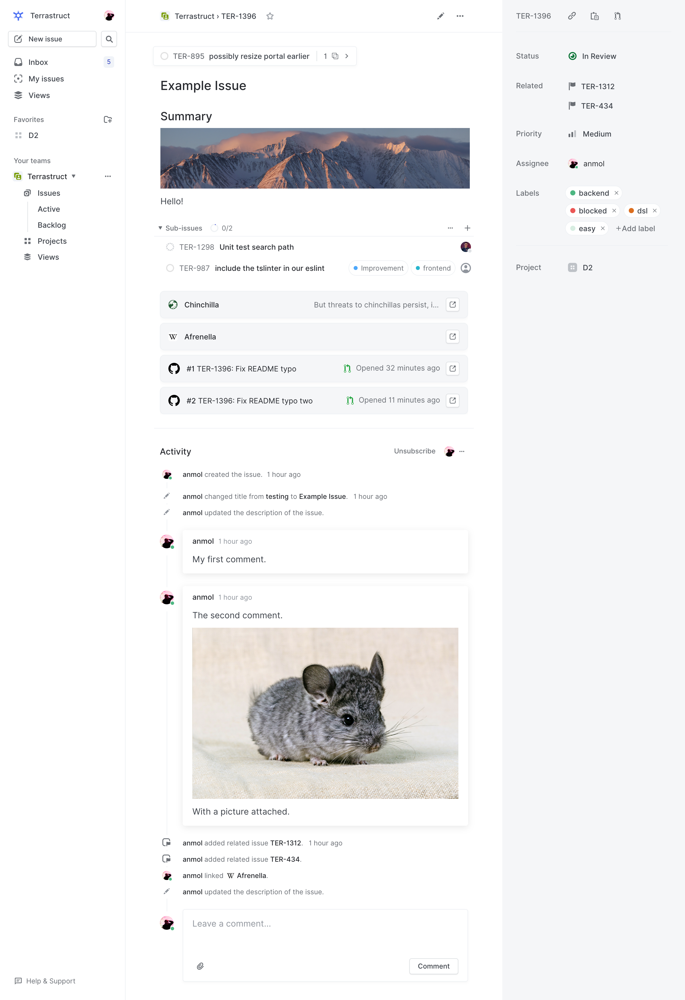
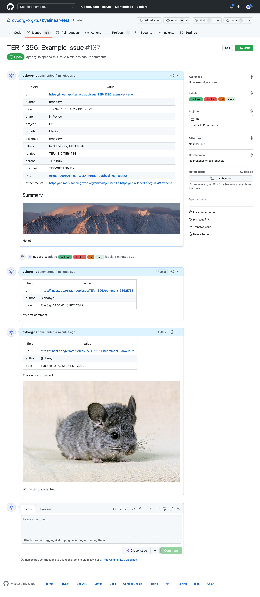

# byelinear

`byelinear` exports Linear issues including assignees, comments, labels, linked issues/PRs and projects to GitHub issues.

While we enjoyed Linear's slick UI and superior featureset, we ultimately decided that we
wanted our issues on the same platform with the rest of our development. GitHub issues
aren't perfect but they work well enough for us and are more tightly integrated with
GitHub. So we wrote this for our internal migration from Linear issues to GitHub issues.

byelinear uses the Linear GraphQL API and the GitHub V3 and V4 APIs.

<!-- toc -->

- [Install](#install)
- [Configuration](#configuration)
- [Caveats](#caveats)
  * [Issues order](#issues-order)
  * [Rate limits](#rate-limits)
  * [Projects](#projects)
- [Example](#example)
  * [Before](#before)
  * [After](#after)
- [Related](#related)

<!-- tocstop -->

## Install

```sh
$ go install oss.terrastruct.com/byelinear@latest
$ byelinear --help
usage:
        byelinear [ from-linear | to-github ]

Use from-linear to export issues from linear and to-github to export issues to github.
See docs and environment variable configuration at https://oss.terrastruct.com/byelinear
```

See configuration to setup the required environment variables. Then see the example below
for how to run and what the logs look like.

## Configuration

```sh
# Location of corpus for issues fetched from Linear.
# Defaults to linear-corpus in the current directory.
export BYELINEAR_CORPUS=

# Use to fetch and export only a single issue by the linear issue number. Useful for testing.
export BYELINEAR_ISSUE_NUMBER=

# org/repo into which to import issues.
# Required when running to-github.
export BYELINEAR_ORG=terrastruct
export BYELINEAR_REPO=byelinear

# Secrets required when importing/exporting with private repos/issues.
export GITHUB_TOKEN=
export LINEAR_API_KEY=
```

## Caveats

### Issues order

byelinear fetches Linear issues in reverse so that the most recent issue is created last
and thus shows up first in GitHub issues.

### Resumption

#### from-linear

If you have thousands of issues and hit a rate limit or something goes wrong, know that
`byelinear from-linear` stores all fetched issues on the disk in
`./linear-corpus/<issue-identifier>.json`. You can ctrl+c and resume later and `byelinear
from-linear` will know to start from the last fetched issue based on
`./linear-corpus/state.json`.

You can change the corpus directory with `$BYELINEAR_CORPUS`.

#### to-github

If something goes wrong when exporting to github and you ctrl+c, you can resume but you
might end up with an incomplete but also duplicate issue. To avoid this, first check your
repo to see the last created issue and ensure the state in the comment/linear matches the
github state. Mainly labels, projects and comments. Make any changes you need to to make
it match. Then go into `./linear-corpus/state.json` and ensure `"exported_to_json":true`.

Now you can restart.

In the future to-github could be improved to allow seamless resumption by storing state
about each successfully completed operation in the state.json instead of just the issue
as a whole.

For now, it's best that once you start, you let it export every issue to GitHub.

### Projects

byelinear gets everything right except for projects and state as there are limitations in
GitHub's project API. There is no way to add a new project state/column programatically so
it tries to map incoming states to GitHub default states as best as possible.

e.g. In Review from Linear becomes In Progress on GitHub. Cancelled becomes Done.

As well, GitHub's projects API does not allow for control over workflow automations like
automatically setting an issue to In Progress when a PR is opened for it. You'll have to
manually go into the projects settings and enable the workflows there.

## Example

The following example fetches issue TER-1396 from linear and then exports it to GitHub.
Empty `$BYELINEAR_ISSUE_NUMBER` to fetch all issues.

```
$ BYELINEAR_ISSUE_NUMBER=1396 LINEAR_API_KEY=lin_api_... go run . from-linear
2022/09/15 12:44:09 fetching 1396
2022/09/15 12:44:10 fetched 1396
```

```
$ BYELINEAR_ISSUE_NUMBER=1396 GITHUB_TOKEN=ghp_... BYELINEAR_ORG=terrastruct BYELINEAR_REPO=byelinear-test go run . to-github
2022/09/15 12:44:49 TER-1396: exporting
2022/09/15 12:44:49 TER-1396: ensuring label: backend
2022/09/15 12:44:49 TER-1396: ensuring label: easy
2022/09/15 12:44:49 TER-1396: ensuring label: blocked
2022/09/15 12:44:50 TER-1396: ensuring label: dsl
2022/09/15 12:44:50 TER-1396: creating
2022/09/15 12:44:51 TER-1396: creating comment 0
2022/09/15 12:44:52 TER-1396: creating comment 1
2022/09/15 12:44:52 TER-1396: ensuring project: D2
2022/09/15 12:44:54 TER-1396: exported: https://github.com/terrastruct/byelinear-test/issues/3
```

### Before



### After



## Related

- [https://github.com/jccr/linear-to-gitlab](https://github.com/jccr/linear-to-gitlab)
