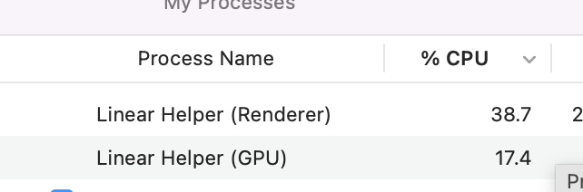

# byelinear

byelinear exports Linear issues including assignees, comments, labels, linked issues/PRs and projects to GitHub issues.

We wrote this for our migration back from Linear issues to GitHub issues.



It will hit the Linear GraphQL complexity limit quite quickly. In our case just 100
issues. byelinear will back off and retry every minute so you can just let it run and
wait until it's done.

Or you can terminate byelinear and then later set `$BYELINEAR_BEFORE` to the ID of the
last successfully exported issue to resume right where you left off. You can find the
ID in the logs.

You can also contact Linear's support support and request they raise your rate limit
temporarily.

It will loop through Linear issues in reverse so that the most recent issue is created
last and thus shows up first in GitHub issues.

It uses the Linear GraphQL API and the GitHub V3 and V4 APIs.

## Example

```sh
go install oss.terrastruct.com/byelinear@latest
```

```sh
# Use to resume export with ID of last successfully exported issue. See logs for ID.
# It's BEFORE because we paginate in reverse as we want most recent issues created last.
export BYELINEAR_BEFORE=...
# Size of pages to fetch from linear.
export BYELINEAR_PAGE_SIZE=10
# org/repo into which to import issues.
export BYELINEAR_ORG=...
export BYELINEAR_REPO=...

# Secrets
export GITHUB_TOKEN=...
export LINEAR_API_KEY=...

byelinear
```

### Before


### After


## Caveats

It gets everything right except for projects and state as there are limitations in
GitHub's project API. There is no way to add a new project state/column programatically so
it tries to map incoming states to GitHub default states as best as possible.

e.g. In Review from Linear becomes In Progress on GitHub. Cancelled becomes Done.

As well, GitHub's projects API does not allow for control over workflow automations like
automatically setting an issue to In Progress when a PR is opened for it. You'll have to
manually go into the projects settings and enable the workflows there.
